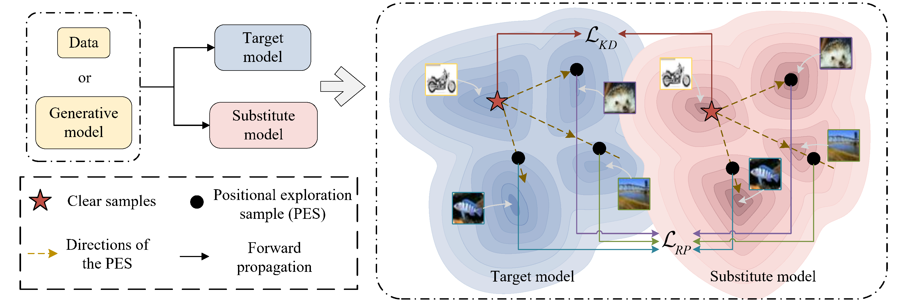
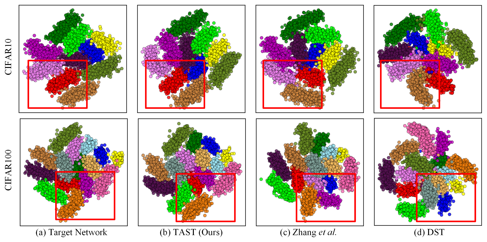
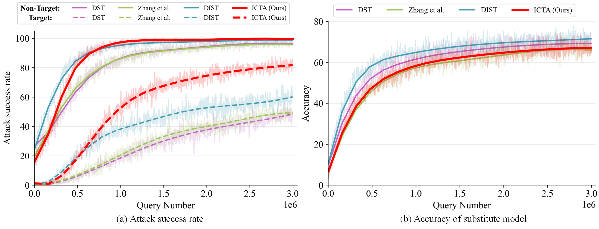

# Inter-Class Topology Alignment
*This project is the main code for ICTA.*

[**Inter-Class Topology Alignment for Efficient Black-Box Substitute Attacks**](**/)<br/>
[Lingzhuang Meng],
[Mingwen Shao]*,
[Wenjie Liu],
[Yuanjian Qiao],
<br/>
_Underview |
[GitHub](https://github.com/LzhMeng/ICTA) | [Project page](https://)_


### Abstract ###
In black-box attacks based on substitute training, the similarity of the substitute model to the target model is critical for successful attacks. 
However, existing schemes merely train the substitute model to mimic the outputs of the target model without fully simulating the decision space, resulting in the adversarial samples generated by the substitute model being classified into the non-target class by the target model. 

To alleviate this issue, we propose a novel Inter-Class Topology Alignment (ICTA) scheme to more comprehensively simulate the target model by aligning the inter-class positional relationships of two models in the decision space. Specifically, we first design the Position Exploration Sample (PES) to more thoroughly explore the relative positional relationships between classes in the decision space of the target model. 
Subsequently, we align the inter-class topology between the two models by utilizing the PES to constrain the inter-class relative position of the substitute model in different directions. 
In this way, the substitute model is more consistent with the target model in the decision space, so that the generated adversarial samples will be more successful in misleading the target model to classify them into the target class. 

The experimental results demonstrate that our ICTA significantly improves attack success rate in various scenarios compared to existing substitute training methods, particularly performing efficiently in target attacks.

- We propose ICTA to innovatively align the substitute model with the target model in terms of inter-class topology in the decision space, which effectively improves the success rate of black-box substitute attack. 
- We propose a novel PES to more comprehensively explore the inter-class relative position of the target model, which is utilized to align the inter-class topology between the substitute model and the target model.
- Experiments illustrate that our ICTA achieves significant performance gains in a variety of scenarios and outperforms on target attacks compared to the existing substitute attack schemes.

## Requirements
A suitable [conda](https://conda.io/) environment named `ICTA` can be created
and activated with:

```
conda env create -f environment.yaml
conda activate ICTA
```

### ICTA
In the first stage, we employ **Position Exploration Sample (PES)** to more comprehensively explore the inter-class relative position of the target model in the decision space.
Then, we can constrain the substitute model to be inter-class consistent with the target model in different directions and distances based on the PES of a clean sample in different directions and at different distances.
This achieves the alignment of the inter-class topology of the two models.

Run the training stage with
```
python train_cifar100.py --targetnet <name-of-target-model> --target_path <path-to-target-model.pth> --Datafree fulldata
```

## Outputs




Benefiting from the better alignment of the two models in the decision space, the adversarial samples generated by the substitute model are more successful in misleading the target model to classify them into the target class.

## Comments 

- The data-free scenario in our scheme builds on the [LCA](https://github.com/LzhMeng/LCA) approach, which is based on the diffusion model [Stable Diffusion](https://github.com/CompVis/latent-diffusion).
- The white-box adversarial sample generation method uses [AdverTorch](https://github.com/borealisai/advertorch)
- Thanks to the [DaST](https://github.com/zhoumingyi/DaST) open-sourcing.


## BibTeX

```
@inproceedings{ICTA2024,
      title={Inter-Class Topology Alignment for Efficient Black-Box Substitute Attacks}, 
      author={Lingzhuang Meng and Mingwen Shao and Wenjie Liu and Yuanjian Qiao},
      year={2024},
	booktitle = {European {Conference} on {Computer} {Vision}},
}
```


